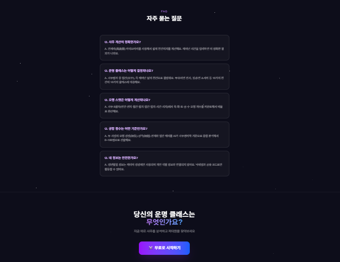
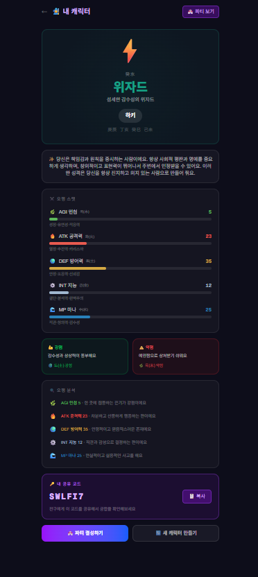
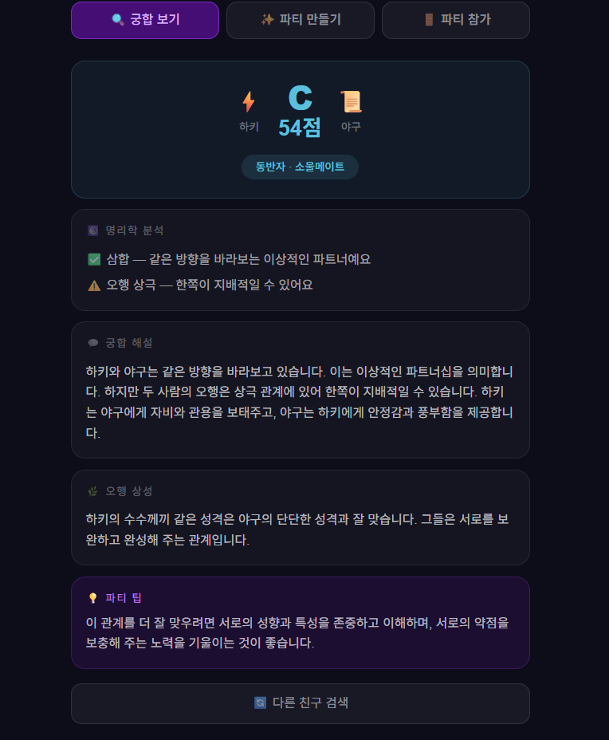

# 🏰 운명길드 (UnMyeong Guild)

> **당신의 팔자로 파티를 결성하라**
> 사주 × RPG × 궁합 서비스

---

## ✨ 서비스 소개

**운명길드**는 사주팔자를 RPG 캐릭터로 변환하고, 친구와 파티를 맺어 궁합을 분석하는 서비스예요.

- 🔮 **만세력 기반** 정확한 사주 계산
- ⚔️ **10가지 운명 클래스** (십천간 기반)
- 📊 **오행 → RPG 스탯** 변환 시스템
- 🏰 **파티 결성** & 친구 초대 코드
- 💫 **AI 궁합 분석** (오행 상생·상극)

---

## 📸 스크린샷

### 시작 화면

|  |  |  |
|---|---|---|

### 내 캐릭터 / 궁합 결과

| 캐릭터 결과 | 궁합 결과 |
|---|---|
|  |  |

---

## 🎮 운명 클래스

| 일간 | 클래스 | 특징 |
|------|--------|------|
| 甲木 | ⚔️ 전사 Warrior | 강인한 리더십 |
| 乙木 | 🏹 레인저 Ranger | 유연한 적응력 |
| 丙火 | 🔮 마법사 Mage | 폭발적 카리스마 |
| 丁火 | 💚 힐러 Healer | 따뜻한 치유력 |
| 戊土 | 🛡️ 나이트 Knight | 묵직한 안정감 |
| 己土 | 📜 세이지 Sage | 깊은 지혜 |
| 庚金 | 🪓 버서커 Berserker | 폭발적 결단력 |
| 辛金 | 🗡️ 어쌔신 Assassin | 예리한 완벽주의 |
| 壬水 | 🌊 소서러 Sorcerer | 신비로운 직관 |
| 癸水 | ⚡ 위자드 Wizard | 섬세한 감수성 |

---

## 📊 오행 스탯 시스템

- 목(木) → AGI 민첩 — 성장·유연성·적응력
- 화(火) → ATK 공격력 — 열정·추진력·카리스마
- 토(土) → DEF 방어력 — 안정·포용력·신뢰감
- 금(金) → INT 지능 — 결단·분석력·완벽주의
- 수(水) → MP 마나 — 직관·창의력·감수성

---

## 🛠️ 기술 스택

| 분류 | 기술 |
|------|------|
| Frontend | Next.js 14, TypeScript, Tailwind CSS, Framer Motion |
| Backend | Next.js API Routes |
| Database | Supabase (PostgreSQL) |
| AI | Groq API (llama-3.3-70b) |
| 사주 계산 | lunar-javascript (만세력) |
| 상태관리 | Zustand |
| 배포 | Vercel |

---

## 🚀 로컬 실행

1. 저장소 클론

       git clone https://github.com/ssongkim03/unmyeong-guild.git
       cd unmyeong-guild

2. 패키지 설치

       npm install

3. 환경변수 설정 — .env.local 파일 생성 후 아래 값 입력

       NEXT_PUBLIC_SUPABASE_URL=your_supabase_url
       NEXT_PUBLIC_SUPABASE_ANON_KEY=your_supabase_anon_key
       SUPABASE_SERVICE_ROLE_KEY=your_service_role_key
       GROQ_API_KEY=your_groq_api_key

4. 개발 서버 실행

       npm run dev

---

## 📁 프로젝트 구조

    src/
    ├── app/
    │   ├── page.tsx           # 랜딩페이지
    │   ├── create/page.tsx    # 캐릭터 생성
    │   ├── character/page.tsx # 내 캐릭터
    │   ├── party/page.tsx     # 파티 시스템
    │   └── api/
    │       ├── characters/    # 캐릭터 API
    │       ├── compatibility/ # 궁합 분석 API
    │       └── parties/       # 파티 API
    ├── lib/
    │   ├── saju.ts            # 만세력 사주 계산
    │   ├── ai.ts              # Groq AI 연동
    │   └── supabase.ts        # DB 연동
    └── types/
        └── index.ts           # TypeScript 타입

---

## 🗺️ 개발 로드맵

- [x] 캐릭터 생성 (만세력 기반)
- [x] 오행 스탯 시스템
- [x] 친구 코드 공유
- [x] 1:1 궁합 분석
- [x] 파티 결성 시스템
- [ ] 소셜 로그인 (카카오/구글)
- [ ] 파티 전체 궁합 분석
- [ ] 오늘의 운세
- [ ] 카카오톡 공유
- [ ] 모바일 앱

---

## 📜 라이선스

MIT License

---

🏰 **운명길드** — 당신의 팔자로 파티를 결성하라
